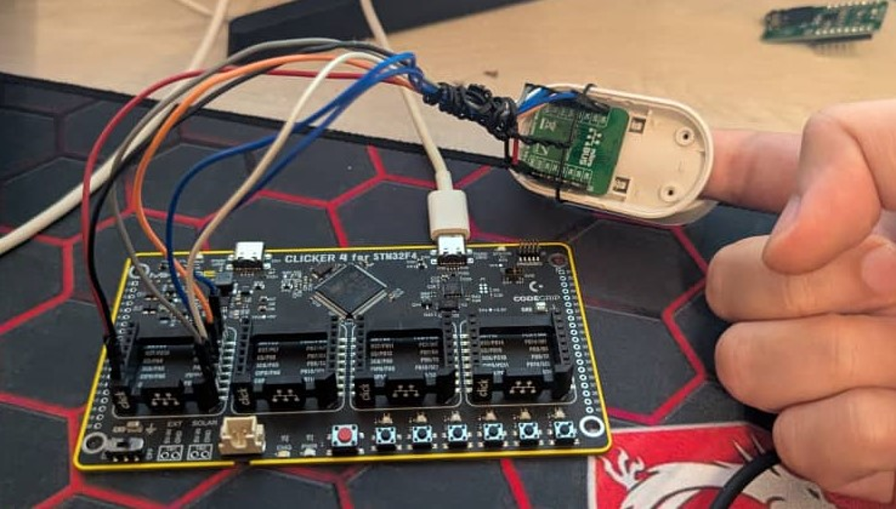
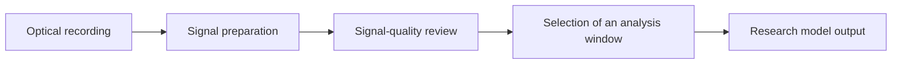
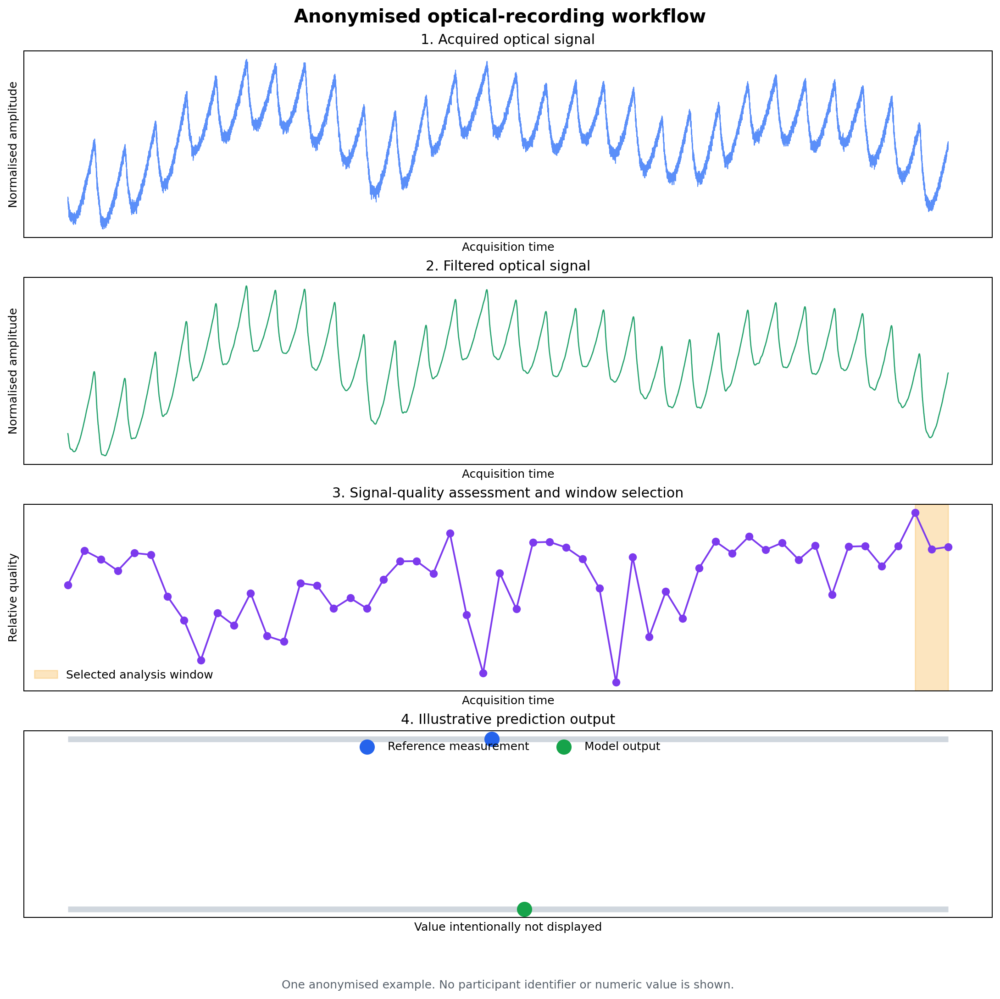

# Non-invasive glucose monitoring research showcase

This repository is a visual research showcase for a PhD project in embedded
systems and biomedical sensing. It presents the hardware prototype, the
high-level software workflow, and one anonymised example of the analysis path.

> **Research prototype only.** This work is not a medical device and does not
> provide a clinically validated glucose measurement.

## Project focus

The project explores whether multi-wavelength optical signals acquired at the
finger can support feasibility-level research on glucose-related information.
The work combines embedded acquisition, optical sensing, signal processing, and
data-driven analysis.

## Hardware prototype

The setup combines an STM32 development platform, a multi-wavelength optical
sensor module, finger contact during acquisition, and a separate reference
measurement workflow. More photographs and a component overview are available
in [Hardware](docs/HARDWARE.md).

## Software workflow

The public overview deliberately omits source code, model configuration,
implementation details, and experimental data. See [Software overview](docs/SOFTWARE.md).

## Anonymised analysis example

This figure illustrates one anonymised workflow from acquired optical signal to
filtered signal, window selection, and a model output. Participant identifiers,
dates, raw values, model parameters, and performance metrics are intentionally
not shown.

## Data and publication policy

This showcase contains no raw recordings, participant metadata, source code,
pipeline configuration, or numerical model results. The full research code and
experimental materials are maintained privately while associated academic work
is under preparation.

See [Anonymisation and responsible sharing](docs/ANONYMISATION.md).

## Author

Yacine Abi Ayad

PhD candidate in Embedded Systems and Biomedical Sensing
Contact: yacine.abiayad.abd@gmail.com
