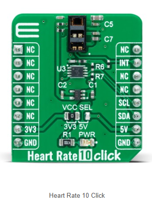
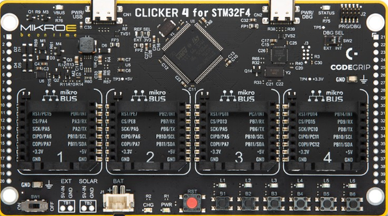
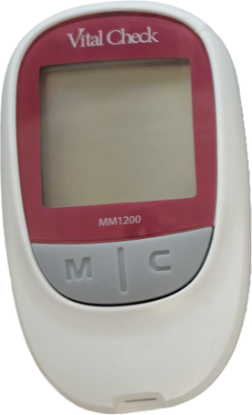
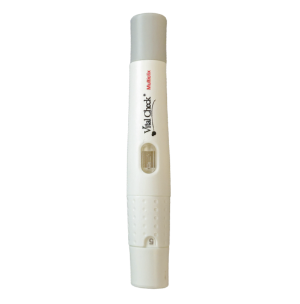

# Hardware overview

## Optical acquisition module

The prototype uses a multi-wavelength optical sensing module with infrared,
red, green, and blue illumination. During a recording, light reflected by the
finger is measured to form an optical pulse signal.

## Embedded acquisition platform

An STM32-based development board manages the sensor and transfers recordings to
a computer for research analysis. The board is used as a prototyping platform,
not as a final wearable product.

## Experimental setup

The photograph above shows the prototype during a finger-contact acquisition.
The setup is designed for research data collection under controlled conditions.

## Separate reference workflow

| Reference meter | Lancing device |
| --- | --- |
|  |  |

The reference measurement is obtained independently from the optical prototype.
It is used only for research comparison and is not produced or replaced by the
optical system.
